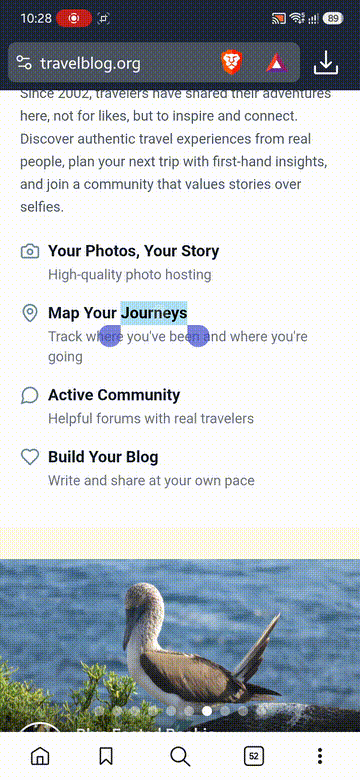
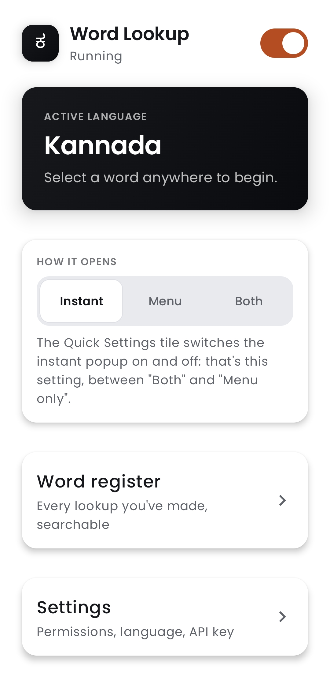
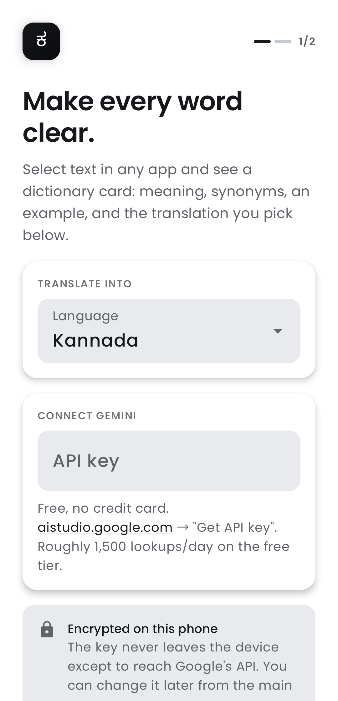
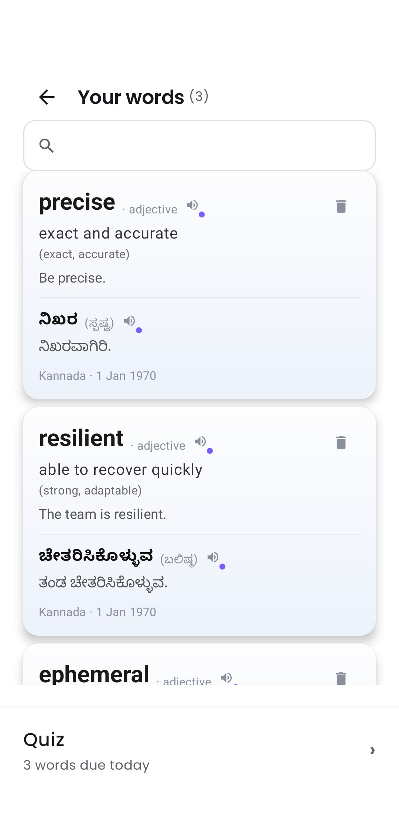
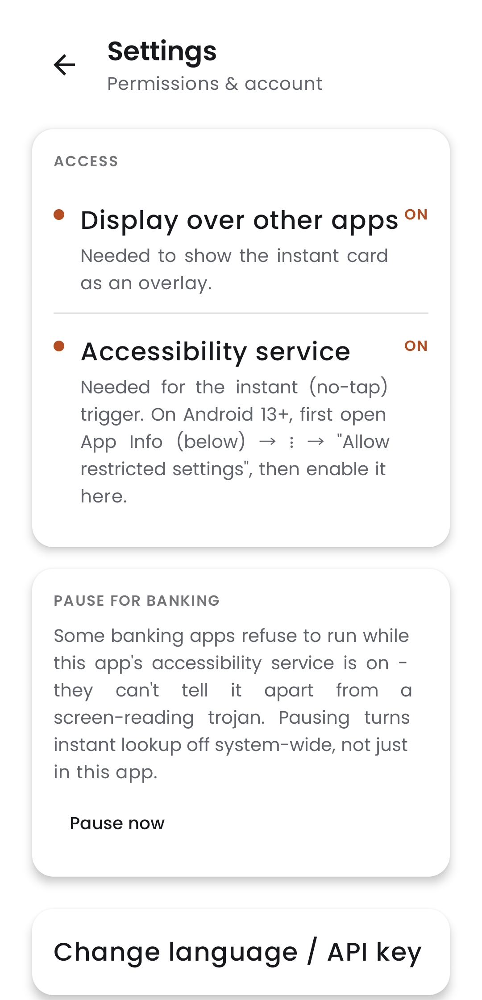

# Word Lookup

As a non-native English speaker, every unknown word cost a tab switch, and that tab switch cost
the next ten minutes of attention. So: select a word, and a card appears at the cursor with its
meaning, part of speech, synonyms, an example sentence, and the translation in a language you
pick. Works in any app where you can select text: a PDF, Word, Slack, a browser. Nothing ever
leaves the page.

<p align="center">
  
  
  
  
  
</p>

## Supported languages

26 targets, picked on first run, switchable anytime from Settings. The app icon changes to a
native glyph of your current language.

**Indian:** Kannada (ಕ), Hindi (अ), Tamil (த), Telugu (త), Malayalam (മ), Marathi (म), Bengali (ব),
Gujarati (ગ), Punjabi (ਪ), Odia (ଓ), Urdu (ا)

**World:** Spanish (Ñ), French (Ç), German (ß), Swedish (Å), Japanese (あ), Korean (한), Chinese
Simplified (中), Arabic (ع), Russian (Я), Portuguese (Ã), Italian (È), Turkish (Ş), Vietnamese (ơ),
Thai (ท), Indonesian (ID)

## How it works

1. Long-press a word to select it, the same way you'd select text to copy it. Drag the handles to
   grab more than one word if you need to. Works in a browser, a PDF, WhatsApp, and most other apps
   with selectable text.
2. Tap **Word Lookup** in the selection menu that pops up, or, if you turned it on, the card
   appears instantly with no tap at all.
3. The text goes to the free Gemini API, which returns the whole card in one call.
4. A small floating card shows up near your selection and disappears on its own after 6 seconds,
   or tap outside it to close it right away. Tapping the card itself keeps it open.
5. Every lookup is saved on your device, so looking up the same word again is instant and works
   with no internet.

## Install

### Download the app

> ### **[Download the APK →](https://github.com/Harishprc/word-lookup-android/releases/latest/download/app-release.apk)**
>
> One file, about 13 MB. Tap it once it's downloaded.

Android will warn that this app isn't from the Play Store ("Install blocked" or "Unknown app").
That's normal for any app installed outside the Play Store, not a sign anything's wrong. Tap
**Settings** on that warning, allow installs from your browser or file app, then go back and tap
**Install**.

### Get a free API key

The app needs a **Gemini API key** to talk to Google's AI and translate your words. Think of it as
a free password just for this app. It is not a credit card and Google does not charge for it.

1. Open [aistudio.google.com](https://aistudio.google.com) on your phone or computer.
2. Sign in with any Google account.
3. Tap **Get API key**, then **Create API key**.
4. Copy the long string of letters and numbers it gives you.

### Finish setup

Open Word Lookup, pick your target language, paste the key you copied, and tap **Save**. That's
it, the app is ready to use.

### Build from source (for developers)

```bash
source tools/env.sh          # or: . .\tools\env.ps1 in PowerShell
./gradlew :app:assembleRelease
./gradlew :app:testReleaseUnitTest
adb install -r app/build/outputs/apk/release/app-release.apk
```

## Permissions

- **Display over other apps**: needed to show the lookup card as a floating window.
- **Accessibility service**: needed only for the instant, no-tap trigger. Skip it and the app
  still works through the selection-menu trigger.

## Known limitations

- No full walkthrough on every Android device yet, only a Samsung S24 so far.
- Some banking apps refuse to run while Accessibility is on. Settings has a one-tap "Pause for
  banking" to work around this.

## License

MIT, see [LICENSE](LICENSE).
